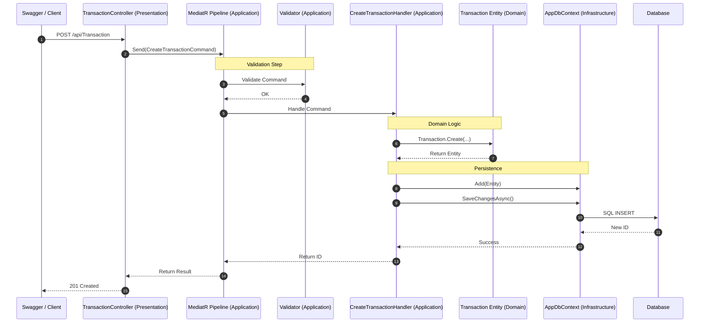

# MyCleanArchitecture

A .NET 10 Web API project built using **Clean Architecture** principles, implementing CQRS with MediatR and FluentValidation.

## Architecture Overview

This project is divided into four main layers to ensure separation of concerns, maintainability, and testability. It follows the **Dependency Rule**, where dependencies only point inwards.

1.  **Domain**: The core of the application. Contains enterprise logic, entities, and business rules. It is completely independent of all other layers and frameworks.
2.  **Application**: Contains business logic and use cases. This layer uses **MediatR** for CQRS (Command Query Responsibility Segregation). It defines interfaces (abstractions) that are implemented by outer layers. It depends only on the Domain layer.
3.  **Infrastructure**: Contains database persistence (EF Core) and other external concerns. It implements the interfaces defined in the Application layer (e.g., `IApplicationDbContext`).
4.  **Presentation / WebApi**: The entry point of the application. The `Presentation` project contains the Controllers, while `WebApi` handles the hosting, configuration, and Swagger.

---

## Request Flow (POST /api/Transaction)

This project uses **MediatR** to decouple the Controllers from the business logic. Instead of calling a service directly, the Controller sends a "Command" or "Query" into a pipeline.

---

## Key Design Patterns

### 1. CQRS (Command Query Responsibility Segregation)
We split "Write" operations (Commands) from "Read" operations (Queries). 
- **Commands**: `CreateTransactionCommand` (Changes state, returns ID).
- **Queries**: `GetTransactionsQuery` (Reads state, returns DTOs).
This makes the code more modular and easier to scale.

### 2. MediatR & Vertical Slices
Instead of one giant `TransactionService`, each use case is a small, self-contained class (a "Slice"). This prevents "Fat Services" and makes testing easier.

### 3. Rich Domain Model
Business logic for creating entities is moved into the Domain layer (e.g., `Transaction.Create`). This ensures the Domain is always in a valid state and isn't just a collection of properties (Anemic Model).

### 4. Decoupled Persistence
The `Application` layer has **no dependency** on Entity Framework Core. It talks to `IApplicationDbContext`, which uses standard C# types. The Infrastructure layer handles the EF-specific implementation details.

---

## Dependency Injection (DI)

### How it's configured:

#### 1. Registration Phase
Each layer has its own `DependencyInjection.cs` file:
- **Infrastructure**: Registers `AppDbContext` and maps it to `IApplicationDbContext`.
- **Application**: Registers all MediatR Handlers and FluentValidation Validators automatically using assembly scanning.

#### 2. Resolution Phase
- When `TransactionController` is created, .NET injects `IMediator`.
- When a command is sent, `MediatR` resolves the correct `Handler`.
- The `Handler` receives the `IApplicationDbContext` injected by the DI container.

---

## Getting Started

### Prerequisites
- .NET 10 SDK
- A database provider (PostgreSQL as configured in `appsettings.json`)

### How to Run
1.  Clone the repository.
2.  Update the connection string in `src/WebApi/appsettings.json`.
3.  Open a terminal in the root folder.
4.  Run migrations: `dotnet ef database update --project src/Infrastructure --startup-project src/WebApi`
5.  Start the API: `dotnet run --project src/WebApi`
6.  Open Swagger at: `http://localhost:<port>/swagger`
