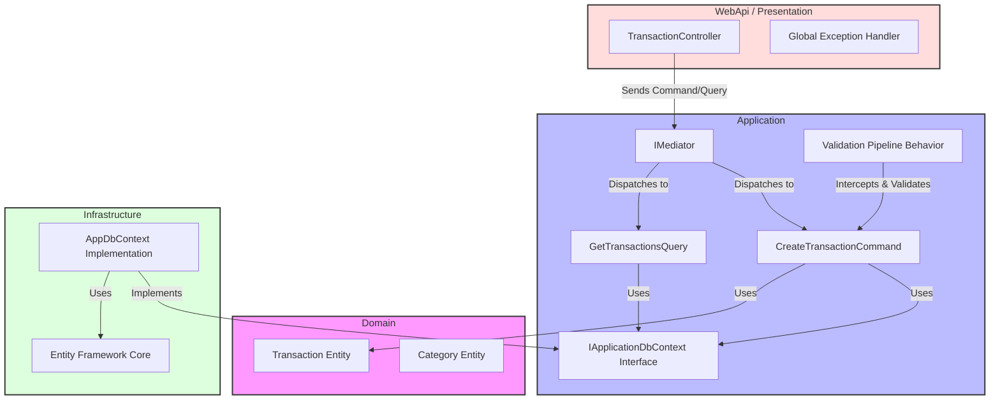

# MyCleanArchitecture

A production-ready **Clean Architecture** template for .NET 10, utilizing **CQRS**, **MediatR**, **FluentValidation**, and **Entity Framework Core**.

---

## Architecture Overview

This project is built using the principles of Clean Architecture, ensuring the core business logic (Domain) is independent of external frameworks (Infrastructure/UI).



---

## Getting Started

### Prerequisites
-   **.NET 10 SDK**
-   **Docker Desktop** (for PostgreSQL)
-   **Git**

### Quick Start (with Docker)
1.  **Clone the Repo**:
    ```bash
    git clone https://github.com/<your-username>/MyCleanArchitecture.git
    cd MyCleanArchitecture
    ```
2.  **Spin up the Infrastructure**:
    ```bash
    docker compose up -d
    ```
3.  **Run the App**:
    ```bash
    dotnet run --project src/WebApi
    ```
4.  **Swagger UI**: Open `http://localhost:8080/swagger`

---

## How to Add a New Feature (e.g., "Category")

Clean Architecture uses **Vertical Slices**. To add a new feature:

1.  **Domain**: Add the entity in `src/Domain/Entities/Category.cs`.
2.  **Infrastructure**: Add `DbSet<Category>` to `AppDbContext.cs` and create a Migration.
3.  **Application**:
    -   Create a folder `src/Application/Categories/Commands`.
    -   Create `CreateCategoryCommand` and `CreateCategoryCommandHandler`.
    -   Create `CreateCategoryCommandValidator`.
4.  **Presentation**: Add a `CategoryController.cs` and use `IMediator` to send the command.

---

## Core Features implemented

-   **CQRS with MediatR**: Separation of Reads and Writes.
-   **Validation Pipeline**: Automated request validation before hitting the database.
-   **Global Exception Handling**: Converts exceptions into clean API responses (Problem Details).
-   **Rich Domain Model**: Logic stays inside Entities, not just "Anemic" DTOs.
-   **Infrastructure Agnostic**: The business layer doesn't know EF Core exists.

---

## Common Problems & Solutions

| Issue | Solution |
| :--- | :--- |
| **Database Connection Failed** | Ensure Docker is running and the connection string in `appsettings.json` or `compose.yaml` matches your local DB. |
| **Migrations not applying** | Run `dotnet ef database update --project src/Infrastructure --startup-project src/WebApi`. |
| **400 Bad Request on Post** | This is the **Validation Shield** at work. Check the response body for specific field errors. |
| **Changes not reflecting** | Run `dotnet build` to ensure all layers are recompiled. |

---

## License
This project is licensed under the MIT License. Feel free to use it for your own learning and projects!
